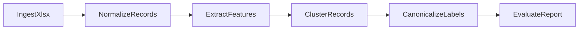

# Smart Product Grouper

**Phase 1 — Foundation (vertical slice):** Excel → Clusters → Canonical Labels → Report.

Product data is ingested from Excel (.xlsx), normalized, clustered, assigned canonical labels, and summarized in a report.

## Before/After examples (including messy raw text)

| Before (raw descriptions) | After (canonical label) |
|---|---|
| `WHITE HANGING HEART T-LIGHT HOLDER` | `white hanging heart t light holder` |
| `white   hanging heart   tlight holder!!!` | `white hanging heart t light holder` |
| `JUMBO BAG RED RETROSPOT` | `jumbo bag red retrospot` |
| `JUMBO--BAG red retro spot` | `jumbo bag red retrospot` |
| `Sparkling Water Lemon 500ml` | `sparkling water lemon 500 ml 500 ml` |
| `SPARKLING WATER  LEMON   0.5 L` | `sparkling water lemon 500 ml 500 ml` |

## Input data

- **File:** `data/online_retail_II.xlsx` — place this file in `data/` for the default run.
- **Sheets:** `Year 2009-2010`, `Year 2010-2011` (both are read and combined).
- **Columns:** Invoice, StockCode, Description, Quantity, InvoiceDate, Price, Customer ID, Country.

## Setup

**One command for new clones:** `make setup` — creates the conda env `datamining` (if missing) and installs dependencies.

Or step by step:
1. `conda create -n datamining python=3 -y` (if not already created)
2. `conda activate datamining`
3. `make install` or `pip install -r requirements.txt`

## Make commands

| Command | Purpose |
|---------|---------|
| `make setup` | Create conda env + install deps (run once per clone) |
| `make run` | Run pipeline on default xlsx (`data/online_retail_II.xlsx`). Override: `make run INPUT=path/to/file.xlsx` |
| `make test` | Run tests (`pytest tests/ -v`) |
| `make demo` | Run pipeline on `data/online_retail_II.xlsx` |
| `make lint` | Lint `src/` with ruff |

All targets use the conda env `datamining` via `conda run`. Or activate `datamining` and run `python run.py data/online_retail_II.xlsx`, `pytest tests/ -v`, `ruff check src/` directly.

## Threshold auto-tuning (CLI)

Use threshold sweep mode to select the best clustering threshold by F1 on a small labeled sample:

```bash
python run.py data/online_retail_II.xlsx \
  --auto-tune-thresholds \
  --labels-path data/labeled_sample.json \
  --tune-thresholds 0.75,0.8,0.85,0.9,0.95
```

Supported label JSON formats:

- Direct mapping: `{"record-1": "group-a", "record-2": "group-b"}`
- Wrapped mapping: `{"labels": {"record-1": "group-a"}}`
- List of rows: `[{"record_id": "record-1", "true_cluster_id": "group-a"}]`

## API demo (`POST /cluster`)

1. Install dependencies: `pip install -r requirements.txt`
2. Start server: `python serve.py`
3. Browser upload flow: open `http://127.0.0.1:8000/`, choose an `.xlsx` file, and submit to view a cluster table.
4. Programmatic JSON API remains at `POST /cluster` (for curl/clients):

```bash
curl -X POST "http://127.0.0.1:8000/cluster" \
  -F "file=@data/online_retail_II.xlsx"
```

## Project layout

| Path | Role |
|------|------|
| `src/ingest.py` | Load product data from Excel (.xlsx) |
| `src/normalize.py` | Clean and standardize raw records |
| `src/extract.py` | Extract features for clustering |
| `src/cluster.py` | Group products into clusters |
| `src/canonicalize.py` | Produce canonical labels per cluster |
| `src/evaluate.py` | Evaluate and build report |
| `src/api.py` | FastAPI endpoint for xlsx upload clustering |
| `serve.py` | Uvicorn server entrypoint for API demo |
| `tests/` | Tests |
| `data/` | Put `online_retail_II.xlsx` here |

Pipeline: **ingest** → **normalize** → **extract** → **cluster** → **canonicalize** → **evaluate** (report).

## Architecture



## Agent layer

This project does not implement a multi-agent orchestration framework.

The practical "agent layer" is the embedding provider used during **extract**:
- `src/extract.py` calls an embedding backend to convert normalized descriptions into vectors.
- `src/embedding.py` provides `OpenAIEmbeddingProvider` (model: `text-embedding-3-small`).

Downstream stages are deterministic pipeline steps:
- **cluster** groups by feature similarity
- **canonicalize** assigns cluster labels
- **evaluate** computes report metrics and suspect-cluster explanations

## Metrics

The report includes these implemented metrics:

- Core: `num_records`, `num_clusters`, `cluster_sizes`, `cluster_stats` (`total_clusters`, `avg_cluster_size`, `largest_cluster`)
- Quality/risk: `suspect_clusters` entries with `cluster_id`, `reasons`, `size`, `risk_score`, `explanation`
- Label output: `labels` mapping (`cluster_id` → canonical label)

When running threshold auto-tuning (`--auto-tune-thresholds`), additional labeled-evaluation metrics are available:

- `precision`, `recall`, `f1`
- Pair-count diagnostics: `tp_pairs`, `fp_pairs`, `fn_pairs`, `num_common_records`
- Sweep summary: `best_threshold`, `best_metrics`, `results`
