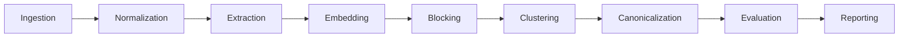

# Smart Product Grouper

Deterministic, explainable, constraint-aware clustering for noisy retail product catalogs.

## 1) Headline

`smart-product-grouper` is an end-to-end clustering system that combines semantic embeddings with deterministic merge constraints, so outputs are both scalable and auditable.

## 2) Industrial Problem Framing

Embedding-only clustering handles wording variation but fails in production catalogs where semantically similar strings can represent different SKUs, sizes, units, or variants. Real data adds punctuation noise, token splits, inconsistent units, and sparse metadata. Without explicit constraints, high-similarity pairs create bad merges that look plausible but break downstream analytics.

This system treats clustering as a constrained decision process:

- Normalize and canonicalize textual inputs before embedding.
- Extract structured attributes (`color`, `quantity_total`, normalized units) as compatibility signals.
- Use cosine similarity for semantic affinity, then enforce conflict checks before edge creation.
- Build clusters through deterministic connected components with stable ordering.

Semantic similarity is important, but never the only decision rule.

## 3) System Overview

- Ingests `.xlsx` workbooks from required retail sheets and validates required columns before downstream processing.
- Applies deterministic cleanup: text normalization, synonym canonicalization, number-word conversion, token-split canonicalization, and optional noise-token removal.
- Converts units to canonical metric form (`kg/lb/oz -> g`, `l -> ml`) and extracts `color` plus `quantity_total`.
- Generates embeddings from normalized descriptions using OpenAI `text-embedding-3-small`.
- Builds candidate pairs via stock-code, prefix, and rare-token blocking for larger inputs; uses all-pairs for small inputs.
- Forms edges by cosine threshold plus compatibility checks across stock code, unit fields, color, and quantity (with toggles).
- Generates canonical labels and evaluates clusters into statistics, suspect diagnostics, and optional edge-level debug output.

## 4) What Makes This Different

### Versus pure embedding clustering

Pure embedding methods over-merge operationally incompatible products. This implementation blocks merges when attribute conflicts are detected, including:

- `stock_code_conflict`
- `unit_name_conflict`
- `unit_system_conflict`
- `unit_value_conflict`
- `color_conflict` (toggleable)
- `quantity_total_conflict` (toggleable)

### Versus simple fuzzy matching

Fuzzy matching is brittle on domain vocabulary and weak on semantic similarity. Here, normalization and synonym canonicalization clean the text surface, embeddings recover semantic proximity, and guardrails control precision.

### Versus naive stock-code grouping

Stock code is treated as a strong signal, not the full strategy. The system supports semantic grouping when stock codes are missing and then flags suspicious mixed-attribute clusters for review.

### Differentiators in practice

- Attribute-conflict guardrails to reduce false merges.
- Candidate blocking to control pairwise cost at scale.
- Threshold selection by F1 through labeled sweeps.
- Risk scoring and suspect-cluster detection with explanations.
- Synonym suggestion output to improve vocabulary coverage over time.

## 5) Architecture (Concise)


```mermaid
flowchart LR
  ingestion[Ingestion] --> normalization[Normalization]
  normalization --> extraction[Extraction]
  extraction --> embedding[Embedding]
  embedding --> blocking[Blocking]
  blocking --> clustering[Clustering]
  clustering --> canonicalization[Canonicalization]
  canonicalization --> evaluation[Evaluation]
  evaluation --> reporting[Reporting]
```

Core stage boundaries are explicit and modular:
`src/ingest.py -> src/normalize.py -> src/extract.py -> src/cluster.py -> src/canonicalize.py -> src/evaluate.py`, with API and report rendering layered on top.

## 6) Explainability & Risk Control

- `evaluate()` emits `suspect_clusters` with `reasons`, `risk_score`, and `explanation`.
- Reason codes are explicit (`stock_code_mixed`, `unit_name_mixed`, `unit_system_mixed`, `unit_value_mixed`).
- Risk score combines mixed-attribute signals with semantic cohesion into a bounded severity measure.
- Optional edge-debug mode (`--edge-debug`, `--edge-debug-top-k`) records pair-level decisions: similarity, stock match, attribute snapshots, conflict reasons, and final edge decision.
- `GET /health/config` reports required runtime configuration presence without leaking secret values.

The pipeline is inspectable at both cluster level (suspect diagnostics) and edge level (debug traces), which supports reproducible failure analysis.

## 7) Evaluation

- `--auto-tune-thresholds` sweeps candidate cosine thresholds against labeled assignments.
- Metrics are pairwise precision, recall, and F1 on overlapping record IDs.
- Diagnostics include `tp_pairs`, `fp_pairs`, `fn_pairs`, and `num_common_records`.
- Selection rule is deterministic: highest F1, tie-break to the higher threshold.
- Chosen threshold is applied to clustering and returned in output.

Threshold choice is therefore measurable, testable, and repeatable.

## 8) Scalability

- Blocking reduces candidate pairs using stock-code, prefix, and rare-token keys.
- CLI controls: `--disable-blocking`, `--blocking-small-input-cutoff`, `--blocking-rare-token-max-frequency`.
- API env controls: `CLUSTER_ENABLE_BLOCKING`, `CLUSTER_BLOCKING_SMALL_INPUT_CUTOFF`, `CLUSTER_BLOCKING_RARE_TOKEN_MAX_FREQUENCY`.
- Deployment surface is FastAPI (`src/api.py`, `serve.py`) with JSON (`POST /cluster`) and browser upload (`/`, `/cluster/view`).

## 9) Quickstart (Minimal & Accurate)

Prerequisite: set `OPENAI_API_KEY` in your shell environment before running the CLI pipeline or API server.

```powershell
pip install -r requirements.txt
```

Run end-to-end clustering on the default sample workbook:

```powershell
python run.py data/online_retail_II.xlsx
```

Run threshold auto-tuning with labeled assignments:

```powershell
python run.py data/online_retail_II.xlsx --auto-tune-thresholds --labels-path data/labeled_sample.json --tune-thresholds 0.75,0.8,0.85,0.9,0.95
```

Start API server:

```powershell
python serve.py
```

Then use:
- Browser upload UI: `http://127.0.0.1:8000/`
- JSON upload endpoint: `POST /cluster`
- Config readiness: `GET /health/config`

## 10) Roadmap

Credible extensions that fit the current architecture:

- Active learning to prioritize uncertain edges and high-risk suspects.
- Domain adapters for category-specific normalization and constraint profiles.
- Human-in-the-loop review queue driven by suspect clusters and edge-debug evidence.
- Offline embedding backend support via the `EmbeddingProvider` interface.

## Why This System Demonstrates Engineering Depth

- Thoughtful architecture: modular stages with clear contracts keep behavior inspectable and replaceable.
- Robustness beyond baseline clustering: semantic edges are constrained by deterministic compatibility checks.
- Industrial relevance: schema-validated ingestion, API upload workflow, and external config-readiness checks.
- Quality governance: reason-coded suspect clusters with bounded risk scores and explanations.
- Measurable optimization: threshold selection driven by precision/recall/F1, not fixed defaults.
- Maintenance depth: synonym suggestion output creates a practical vocabulary-improvement loop.
