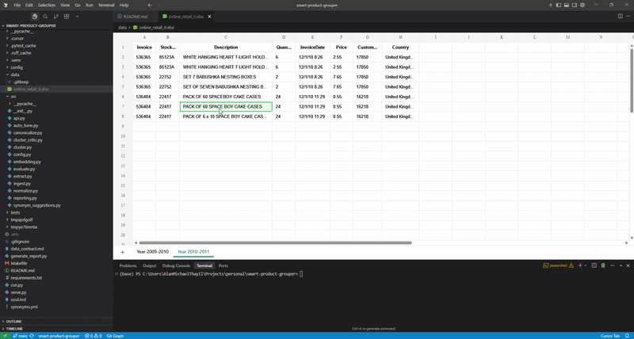

# Smart Product Grouper

Deterministic, explainable, constraint-aware clustering for noisy retail product catalogs.



---

## Overview

`smart-product-grouper` is an end-to-end clustering system that combines semantic embeddings with deterministic merge constraints. The result is scalable clustering that remains auditable and production-safe.

Unlike embedding-only systems, this pipeline treats clustering as a constrained decision process: semantic similarity is necessary, but never sufficient on its own.

---

## Why This Exists

Embedding-only clustering performs well on clean text, but production retail catalogs contain:

* SKU variants with nearly identical descriptions
* Inconsistent unit systems (kg/lb/oz, l/ml)
* Token splits and punctuation noise
* Sparse or partially structured metadata

Without explicit compatibility checks, high-similarity pairs can produce incorrect merges that look plausible but break downstream analytics.

This system:

* Normalizes and canonicalizes text before embedding
* Extracts structured attributes (`color`, `quantity_total`, normalized units)
* Uses cosine similarity for semantic affinity
* Enforces deterministic conflict checks before merging
* Builds clusters via stable connected components

---

## Quickstart

### Prerequisites

* Python 3.9+
* `pip`
* An OpenAI API key (for embeddings)
* A sample `.xlsx` retail workbook (a sample file is expected at `data/online_retail_II.xlsx` or provide your own path)

Set your API key in the same shell session you will use to run the pipeline:

```bash
export OPENAI_API_KEY=your_key_here
```

Install dependencies:

```bash
pip install -r requirements.txt
```

Run end-to-end clustering:

```bash
python run.py data/online_retail_II.xlsx
```

Run threshold auto-tuning with labeled assignments:

```bash
python run.py data/online_retail_II.xlsx \
  --auto-tune-thresholds \
  --labels-path data/labeled_sample.json \
  --tune-thresholds 0.75,0.8,0.85,0.9,0.95
```

Start the API server:

```bash
python serve.py
```

Then access:

* Browser UI: `http://127.0.0.1:8000/`
* JSON endpoint: `POST /cluster`
* Config health: `GET /health/config`

---

## Dataset

This project uses the **Online Retail II** dataset from the UCI Machine Learning Repository.

* Source: [https://archive.ics.uci.edu/dataset/352/online+retail](https://archive.ics.uci.edu/dataset/352/online+retail)
* Time period: 01/12/2010 – 09/12/2011
* Records: ~541,000 transactions
* Domain: UK-based non-store online retail

Download the dataset and place the Excel file at:

```bash
data/online_retail_II.xlsx
```

You may also provide your own `.xlsx` file, provided it contains the required columns:

* InvoiceNo
* StockCode
* Description
* Quantity
* InvoiceDate
* UnitPrice

### Data Assumptions

* Canceled invoices (InvoiceNo starting with "C") may be filtered depending on configuration.
* UnitPrice is assumed to be in GBP (sterling).
* Description is treated as the primary clustering surface.

---

## System Architecture

Pipeline stages are modular and explicit:

```
src/ingest.py
→ src/normalize.py
→ src/extract.py
→ src/cluster.py
→ src/canonicalize.py
→ src/evaluate.py
```

The API layer (`src/api.py`, `serve.py`) sits on top of this core pipeline.

Each stage has a single responsibility, making behavior inspectable and replaceable.

---

## How Clustering Works

### 1. Normalization

* Text cleanup and canonicalization
* Synonym resolution
* Number-word conversion
* Token split normalization
* Optional noise-token removal

### 2. Attribute Extraction

* Unit normalization (`kg/lb/oz → g`, `l → ml`)
* `color` extraction
* `quantity_total` extraction

### 3. Embedding

* OpenAI `text-embedding-3-small`
* Cosine similarity for candidate edges

### 4. Guardrails

Edges are only formed if no attribute conflicts are detected:

* `stock_code_conflict`
* `unit_name_conflict`
* `unit_system_conflict`
* `unit_value_conflict`
* `color_conflict` (toggleable)
* `quantity_total_conflict` (toggleable)

### 5. Cluster Construction

* Deterministic connected components
* Stable ordering for reproducibility

---

## Evaluation & Threshold Tuning

Optional threshold sweeps allow measurable optimization:

* Pairwise precision
* Pairwise recall
* F1 score

Selection rule:

* Highest F1 wins
* Tie-breaker: higher threshold

Diagnostics include:

* `tp_pairs`
* `fp_pairs`
* `fn_pairs`
* `num_common_records`

Threshold choice is measurable and repeatable.

---

## Explainability & Risk Control

`evaluate()` emits:

* `suspect_clusters`
* `reasons`
* `risk_score`
* `explanation`

Optional edge-debug mode:

```
--edge-debug
--edge-debug-top-k
```

Records:

* Similarity score
* Attribute snapshots
* Conflict reasons
* Final edge decision

The pipeline is inspectable at both cluster and edge levels.

---

## Scalability Controls

Blocking strategies reduce pairwise comparisons:

* Stock-code blocking
* Prefix blocking
* Rare-token blocking

CLI controls:

```
--disable-blocking
--blocking-small-input-cutoff
--blocking-rare-token-max-frequency
```

API environment variables:

* `CLUSTER_ENABLE_BLOCKING`
* `CLUSTER_BLOCKING_SMALL_INPUT_CUTOFF`
* `CLUSTER_BLOCKING_RARE_TOKEN_MAX_FREQUENCY`

---

## Roadmap

* Active learning for uncertain edges
* Domain-specific constraint profiles
* Human-in-the-loop review queue
* Offline embedding backend support

---

## Contributing

Contributions are welcome. Please open an issue to discuss major changes before submitting a pull request.

---

## License

This project is licensed under the MIT License. See `LICENSE` for details.

---

## Notes

This project is designed for production-grade retail catalog clustering, where correctness, auditability, and constraint enforcement matter as much as semantic similarity.
